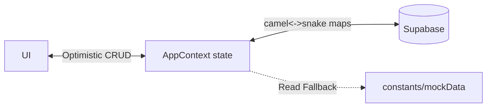

## AGENT QUICK REF
SYS: Digital Marketing Platform MVP
ENT: SEG(Segments), CMP(Campaigns), DC(Dynamic Content), RR(Rec Rules)
RULE: Optimistic UI; AC(camelCase)<->SB(snake_case); Auto-mock fallback.

## DATA FLOW

## CORE MODULES
| Mod | File/Component | Action |
|---|---|---|
| CMP | Campaign{Dash,List,Create,Calendar,Optimization}Page | CRUD + schedule + A/B test |
| SEG | Segment{List,Create}Page, AudienceInsightsPage | Target + filter logic |
| CDN | DynamicContentPage, PushNotificationPage, RecommendationsPage | Edit content + rules |
| ANL | AnalyticsDashboardPage, ReportsPage, OverviewDashboardPage | View KPI + funnel |
| DPL | DataPipelinePage, ActivityLogPage, NotificationsPage | Manage jobs + logs |

## BUSINESS RULES
- **State**: React Context (`AppContext.jsx`) = single source of truth.
- **Failover**: `catch(err) => set*(MOCK_*)` on initial SB fetch.
- **CORS**: Edge Config mocked via `getEdgeConfigValue()`.
- **Status Enum**: Optimization uses `[applied, dismissed, deployed]`.

## TERMINOLOGY
| Term | Def |
|---|---|
| EJ | Enrichment Job: Merges external data |
| AT | Attribution: Touchpoint credit |
| FA | Fatigue Alert: Overage warning |
| FO | Frequency Override: Cap bypass |
