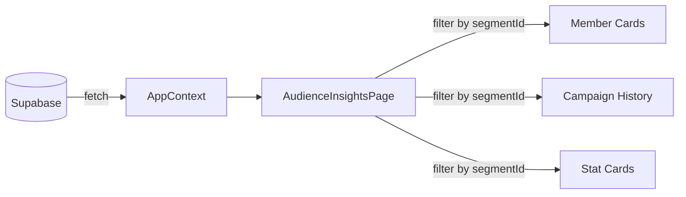

## AGENT QUICK REF
MOD: Audience Insights — drill into segment health, member profiles, campaign history
ENT: AudienceSegment, AudienceMember, AudienceCampaignHistory, AudienceStatCard
RULE: Read-only; all entities are scoped by segmentId; AudienceSegments ≠ Segments (different entity, no CRUD)
DEPS: ← AppContext (audienceSegments, audienceMembers, audienceCampaignHistory), cross-ref → Campaigns (campaignId)

## DATA FLOW

## ENTITY: AudienceSegment (insight view, not CRUD segment)
| Field | Type | Meaning |
|---|---|---|
| id | string | slug key, e.g. `gold-at-risk` |
| name | string | Display label |
| count | string | Formatted member count |
| active | boolean | Whether segment is in active campaign |
| colors | string[] | CSS bg classes for visual chips |
| campaignIds | string[] | Linked campaign IDs |

## ENTITY: AudienceMember
| Field | Type | Meaning |
|---|---|---|
| id | string | `TH-XXXXXX` (member ID) |
| segmentId | string | FK → AudienceSegment.id |
| name | string | Display name (anonymized) |
| tier | enum | `Bronze\|Silver\|Gold\|Platinum` |
| pts | string | Points balance (formatted) |
| last | string | Last transaction date |
| days | string | Days since last transaction (e.g. `74d`) |
| push | boolean | Push notifications enabled |
| status | enum | `At Risk\|Critical\|Lapsed` | Risk label |

## ENTITY: AudienceStatCard
| Field | Meaning |
|---|---|
| segmentId | Scoping FK |
| title | Metric name |
| value | Formatted value |
| trend | e.g. `↑ 12%` or `↓ 14%` |
| sub | Optional sub-label |
| downIsBad | If true, red-color negative trend |

## ENTITY: AudienceCampaignHistory
| Field | Type | Meaning |
|---|---|---|
| segmentId | string | Scoping FK |
| campaignId | string | FK → Campaign |
| campaign | string | Campaign display name |
| period | string | Date range |
| impressions | string | Formatted impressions |
| ctr / ctrStatus | string / enum | CTR value + `good\|neutral\|bad` |
| cvr | string | Conversion rate |
| revenue | string | ฿ attributed revenue |
| roas / roasStatus | string / enum | ROAS value + `good\|neutral\|bad` |

## MEMBER STATUS DEFINITIONS
| Status | Meaning |
|---|---|
| At Risk | High-value, declining activity |
| Critical | Highest-value, significant inactivity (85+ days) |
| Lapsed | 90+ days inactive |

## BUSINESS RULES
- All data filtered client-side by `segmentId` (no separate API call per segment selection)
- `ctrStatus/roasStatus` = `good` if above platform avg; `bad` if significantly below; `neutral` otherwise
- Platform avg CTR = 12.4%; platform avg CVR = 15.1%
- `active=false` segments have `campaignIds=[]`
- `AudienceSegments` is a separate table/mock from `Segments` — insight-specific snapshot, not editable

## DEV TASK MAP
| Task | Files (in order) |
|---|---|
| Add member field | `mockData.js` (AUDIENCE_MEMBERS) → `AudienceInsightsPage.jsx` |
| Add insight segment | `mockData.js` (AUDIENCE_SEGMENTS + AUDIENCE_STAT_CARDS) |
| Add campaign history row | `mockData.js` (AUDIENCE_CAMPAIGN_HISTORY) |
| Change status color thresholds | `AudienceInsightsPage.jsx` (ctrStatus/roasStatus logic) |

## FILES
| File | Role |
|---|---|
| `pages/AudienceInsightsPage.jsx` | Full insights page (33KB — largest page) |
| `context/AppContext.jsx` | audienceSegments, audienceMembers, audienceCampaignHistory |
| `constants/mockData.js` | AUDIENCE_SEGMENTS[], AUDIENCE_STAT_CARDS[], AUDIENCE_MEMBERS[], AUDIENCE_CAMPAIGN_HISTORY[] |
