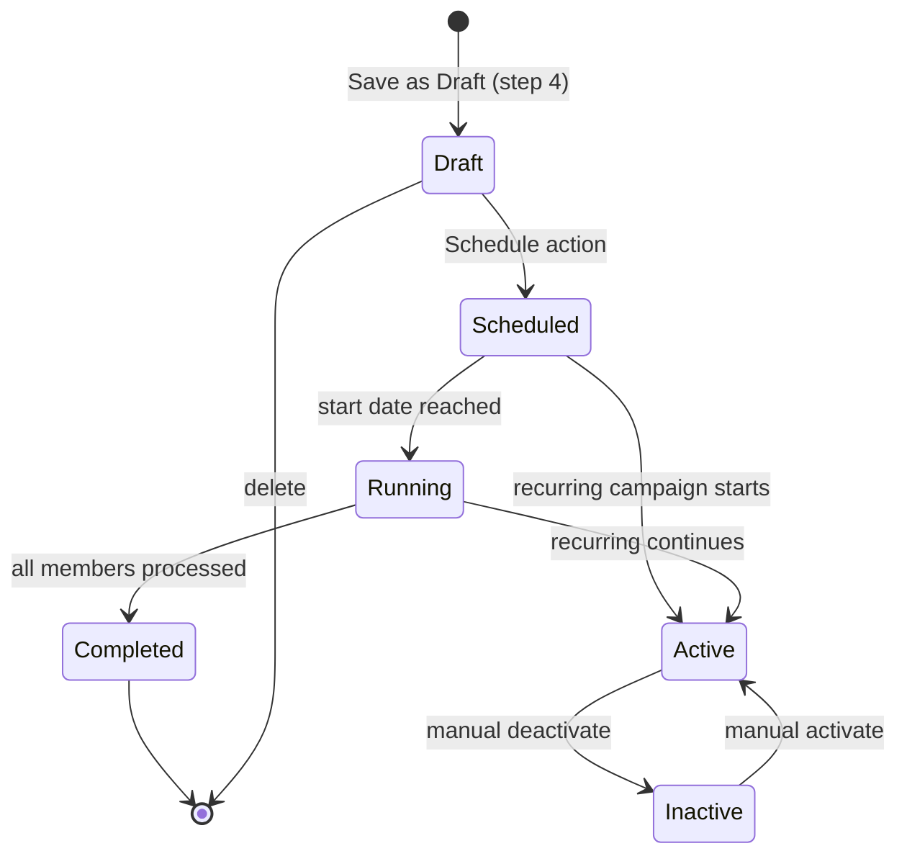

## AGENT QUICK REF
MOD: Campaign — create, schedule, deliver, and optimize marketing campaigns
ENT: Campaign (core), CampaignWizard (4-step form)
RULE: code auto-built from name as `CAM-{SLUG}`; min 1 segment; start+end date required; DM type needs ≥1 channel; Loyalty type needs no channel
DEPS: → Segments (segmentIds[]), → DynamicContent (delivery[dc_*]), → PushTemplates (delivery[pt_*]), → RecommendationRules (delivery[rr_*])

## STATE DIAGRAM


## ENTITY: Campaign (core fields)
| Field | Type | Constraint | Meaning |
|---|---|---|---|
| id / code | string | `CAM-{SLUG}`, unique | PK; auto-generated |
| name | string | required | Display title |
| type | enum | `DM Delivery\|Loyalty Action` | Delivery mode |
| segmentId / segmentIds | string\|string[] | ≥1 required | Target audience refs |
| status | enum | `Draft\|Scheduled\|Running\|Active\|Completed\|Inactive` | Lifecycle |
| schedule | string | human-readable display | e.g. `Daily at 09:00` |
| totalMembers | number | snapshot at schedule time | Audience size |
| processed | number | ≥0, ≤totalMembers | Members delivered to |
| lastRun | string | relative timestamp | — |
| nextRun | string\|null | null when done | — |

## ENTITY: Campaign (wizard-only fields)
| Field | Default | Constraint | Meaning |
|---|---|---|---|
| audienceLogic | `Union` | `Union\|Intersection` | Multi-segment join mode |
| startDate / endDate | '' | both required (step 2) | Schedule range |
| startTime | `09:00` | HH:MM | Daily run time |
| scheduleType | `One-time` | `One-time\|Daily\|Weekly\|Monthly` | Recurrence |
| repeatDays | [] | if Weekly | Days of week |
| multipleRunTimes | false | boolean | Run >1x per day |
| runTimes | [] | if multipleRunTimes | Additional HH:MM slots |
| freqCapOverride | false | bool | Override global frequency cap |
| freqCapMax | `3` | if override | Max sends/day |
| channels | {} | `{push:{enabled,templateId}, popup:{...}, banner:{...}}` | DM channels config |
| loyaltyAction | `Award Points` | `Award Points\|Upgrade Tier\|Issue Voucher` | if type=Loyalty |
| pointsAward | '' | if loyaltyAction=Award Points | Points value |
| pointsExpiry | `90` | days | Points TTL |
| upgradeTo | `Gold` | tier name | Target tier |
| tierDuration | `permanent` | `permanent\|until_date` | Tier validity |

## WIZARD STEPS
| Step | ID | Key Validation |
|---|---|---|
| 0 | basic | name required, code required |
| 1 | target | segmentIds.length≥1, startDate required, endDate required |
| 2 | channels | ≥1 channel enabled OR type=Loyalty Action |
| 3 | review | no validation; exposes Schedule / Launch / Save Draft |

## CODE AUTO-GENERATION RULE
```js
// triggered when name changes AND code still starts with 'CAM-'
buildCode(name) => `CAM-${name.toUpperCase().replace(/[^A-Z0-9]/g,'-').slice(0,20)}`
```

## BUSINESS RULES
- Loyalty Action campaigns bypass channel validation (no push/banner needed)
- `freqCapOverride=true` → per-campaign cap takes precedence over FREQUENCY_OVERRIDES table
- `multipleRunTimes=true` → `runTimes[]` list defines additional send slots per day
- `audienceLogic=Union` (default) → members in ANY selected segment are targeted
- `audienceLogic=Intersection` → members must be in ALL selected segments
- Overlap warning shown in wizard when segments share members (UI only, no block)
- `delivery[]` array links to `dc_*` (Dynamic Content), `pt_*` (Push Template), `rr_*` (Rec Rule) IDs

## STATUS TRANSITIONS
| From | To | Trigger |
|---|---|---|
| [new] | Draft | Save as Draft |
| Draft | Scheduled | Schedule action (step 4) |
| Draft | Active | Launch action (step 4) |
| Scheduled | Running | Start date reached |
| Running | Completed | processed = totalMembers |
| Active | Inactive | Manual deactivate |
| Inactive | Active | Manual activate |

## DEV TASK MAP
| Task | Files (in order) |
|---|---|
| Add wizard field | `CampaignWizard.jsx` (INITIAL_DATA) → relevant Step component |
| Add campaign list column | `CampaignTable.jsx` |
| Add new campaign type | `CampaignWizard.jsx` (INITIAL_DATA.campaignType options) → `DeliveryStep.jsx` |
| Add new schedule type | `TargetDataStep.jsx` → `CampaignWizard.jsx` (validateStep) |
| Change status logic | `AppContext.jsx` (updateCampaign) |
| Add calendar event | `CampaignCalendarPage.jsx` |

## FILES
| File | Role |
|---|---|
| `pages/CampaignListPage.jsx` | List + quick actions |
| `pages/CreateCampaignPage.jsx` | Mounts CampaignWizard |
| `pages/CampaignDashboardPage.jsx` | Per-campaign analytics view |
| `pages/CampaignCalendarPage.jsx` | Calendar visualization |
| `pages/CampaignOptimizationPage.jsx` | Suggestions + A/B + Fatigue |
| `components/campaigns/CampaignWizard.jsx` | 4-step form, validation, INITIAL_DATA |
| `components/campaigns/steps/BasicInfoStep.jsx` | Step 0 |
| `components/campaigns/steps/TargetDataStep.jsx` | Step 1 (segment + schedule) |
| `components/campaigns/steps/DeliveryStep.jsx` | Step 2 (channels + content) |
| `components/campaigns/steps/ScheduleStep.jsx` | Step 3 (review + launch) |
| `components/campaigns/CampaignTable.jsx` | Table + row actions |
| `context/AppContext.jsx` | addCampaign, updateCampaign, deleteCampaign |
| `constants/mockData.js` | CAMPAIGNS[] |
