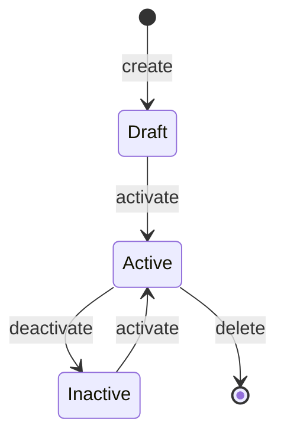
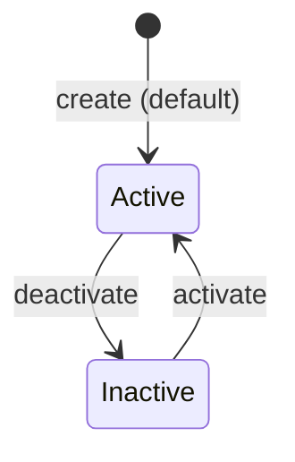

## AGENT QUICK REF
MOD: Content & Delivery — DynamicContent + PushTemplates + RecommendationRules
ENT: DynamicContent (dc_*), PushTemplate (pt_*), RecommendationRule (rr_*)
RULE: Each entity links to a campaignId + segmentId; DC supports per-segment payload variations; RR priority is integer rank (lower = higher priority)
DEPS: ← Campaigns (delivery[] refs dc_*, pt_*, rr_*), → Segments (segmentId), → ProductCatalog (products[])

## STATE DIAGRAMS

### Dynamic Content

### Recommendation Rule

## ENTITY: Dynamic Content (dc_*)
| Field | Type | Constraint | Meaning |
|---|---|---|---|
| id | string | `dc_N` | PK |
| name | string | required | Display label |
| type | enum | `Banner\|Popup` | Render format |
| campaignId | string | FK → Campaign.id | Parent campaign |
| segmentId | string | FK → Segment.id | Target segment |
| status | enum | `Active\|Inactive\|Draft` | Lifecycle |
| updated | string | relative timestamp | — |
| payload.visualUrl | string | image path | Asset served to app |
| payload.ctaAction | string | deeplink / URL | On-tap destination |
| payload.segmentVariation | object | `{segmentId: string}` | Per-segment content override |

## ENTITY: Push Template (pt_*)
| Field | Type | Constraint | Meaning |
|---|---|---|---|
| id | string | `pt_N` | PK |
| campaignId | string | FK → Campaign.id | Parent campaign |
| title | string | required | Notification title (supports Thai) |
| body | string | required | Notification body |
| trigger | string | deeplink\|URL | On-tap destination |
| segmentId | string | FK → Segment.id | Target segment |

## ENTITY: Recommendation Rule (rr_*)
| Field | Type | Constraint | Meaning |
|---|---|---|---|
| id | string | `rr_N` | PK |
| name | string | required | Display label |
| trigger / triggerId | string | segment name / FK | Audience trigger |
| products | string[] | from PRODUCT_CATALOG | Products to recommend |
| placements | string[] | `Home Screen\|After Login\|After Transaction\|Notification` | Where shown |
| priority | number | integer, lower = higher priority | Render order |
| status | enum | `Active\|Inactive` | Lifecycle |
| shown | number | ≥0 | Total impressions |
| ctr | string | `%` or `—` | Click-through rate |
| layout.type | enum | `carousel\|banner` | if campaignId linked |
| layout.maxItems | number | — | Item cap in layout |

## PRODUCT CATALOG (reference)
| Category | Products |
|---|---|
| Financial | Personal Loan, Home Loan |
| Investment | Investment Account |
| Savings | Premium Savings |
| Insurance | Life Insurance, Travel Insurance |
| Card | Cashback Visa Card |
| Feature | QR Payment Setup |
| Loyalty | Points Redemption Guide |
| Promotion | Birthday Cashback Voucher, Partner Merchants, Referral Bonus |

## BUSINESS RULES
- `payload.segmentVariation` allows one DC asset to serve different copy per segment without duplicating the record
- `ctaAction` format: `Direct to Service Screen → {action}` OR `Direct to URL → {url}` OR `{action}` (bare deeplink)
- RR `priority` is global rank; lower integer wins if two rules match same user
- `shown=0` and `ctr='—'` means rule is configured but not yet deployed/active
- Push Template `title` and `body` support Thai text and emoji
- DM campaigns reference `delivery[]` array containing mix of dc_*, pt_*, rr_* IDs

## DEV TASK MAP
| Task | Files (in order) |
|---|---|
| Add DC type (e.g. Toast) | `mockData.js` (DYNAMIC_CONTENTS type enum) → `DynamicContentPage.jsx` |
| Add new placement to RR | `mockData.js` (RECOMMENDATION_RULES.placements) → `RecommendationsPage.jsx` |
| Add push template | `mockData.js` (PUSH_TEMPLATES) → link campaignId |
| Add per-segment DC variation | `mockData.js` → `payload.segmentVariation` object |
| View push history | `PushNotificationPage.jsx` consumes `pushHistory` from AppContext |

## FILES
| File | Role |
|---|---|
| `pages/DynamicContentPage.jsx` | DC list + manage |
| `pages/PushNotificationPage.jsx` | Push templates + history list |
| `pages/RecommendationsPage.jsx` | RR list + priority management |
| `context/AppContext.jsx` | addContent/updateContent/deleteContent, addRule/updateRule/deleteRule, pushHistory/pushTemplates |
| `constants/mockData.js` | DYNAMIC_CONTENTS[], PUSH_TEMPLATES[], PUSH_HISTORY[], RECOMMENDATION_RULES[], PRODUCT_CATALOG[] |
