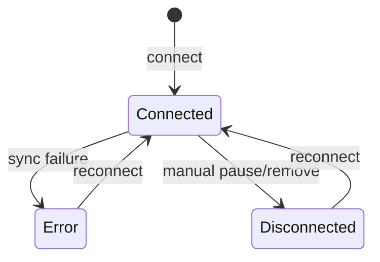
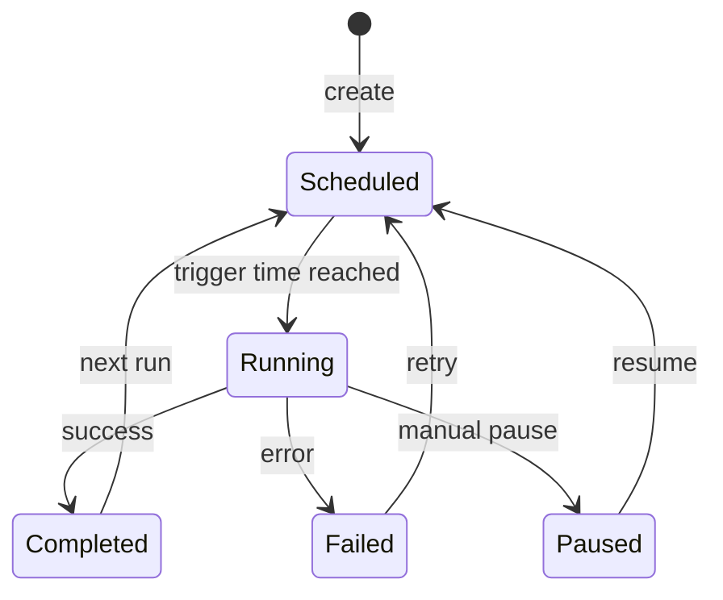

## AGENT QUICK REF
MOD: Data Pipeline — manage external data sources, enrichment jobs, and activity log
ENT: DataSource (ds_*), EnrichmentJob (job_*), PipelineLog (log_*)
RULE: Pipeline state loaded from mock only (no Supabase tables yet); DataSource feeds EnrichmentJob via sourceIds[]; Job outputs to a named outputDataset
DEPS: AppContext (dataSources, enrichmentJobs, pipelineLog); DATASETS in ConditionBuilder maps to outputDataset names

## STATE DIAGRAMS

### DataSource

### EnrichmentJob

## ENTITY: DataSource (ds_*)
| Field | Type | Constraint | Meaning |
|---|---|---|---|
| id | string | `ds_N` | PK |
| name | string | required | Display label |
| type | enum | `CRM\|Transactions\|Loyalty\|App Events\|Custom\|Manual Upload` | Source category |
| status | enum | `Connected\|Error\|Disconnected` | Sync health |
| recordCount | number | ≥0 | Total records ingested |
| lastSync | string | relative timestamp | — |
| syncFrequency | string | e.g. `Real-time\|Hourly\|Daily\|Weekly` | Cadence |
| fieldsCount | number | — | Active field mappings |

## ENTITY: EnrichmentJob (job_*)
| Field | Type | Constraint | Meaning |
|---|---|---|---|
| id | string | `job_N` | PK |
| name | string | required | Display label |
| sourceIds | string[] | FK[] → DataSource.id | Input data sources |
| outputDataset | string | must match a DATASETS value | Target dataset namespace |
| type | enum | `Score\|Merge\|Transform\|Deduplicate` | Job operation |
| schedule | string | cron-like human string | Run frequency |
| status | enum | `Completed\|Running\|Paused\|Scheduled\|Failed` | Lifecycle |
| lastRun | string | — | — |
| nextRun | string | `Pending Retry` if Failed | — |
| recordsProcessed | number | ≥0 | Total input records |
| recordsEnriched | number | ≥0, ≤recordsProcessed | Successfully enriched |
| enrichmentRate | string | `%` | recordsEnriched/recordsProcessed |

## JOB TYPES
| Type | Meaning |
|---|---|
| Score | Generates numeric scores (e.g. LTV, churn risk) |
| Merge | Joins records across sources (e.g. offline + online) |
| Transform | Cleans/normalizes data (e.g. tag cleanse) |
| Deduplicate | Removes duplicate records |

## ENTITY: PipelineLog (log_*)
| Field | Type | Meaning |
|---|---|---|
| id | string | `log_N` |
| timestamp | ISO8601 | `Date.now() - N*60000` pattern in mock |
| type | enum | `sync\|job\|error\|info` |
| source | string | DataSource name or Job name |
| message | string | Short summary |
| details | string | Full details |

## LOG TYPE COLOR CODING
| type | UI meaning |
|---|---|
| sync | Blue — data ingestion event |
| job | Green — enrichment job event |
| error | Red — failure event |
| info | Gray — informational / manual action |

## OUTPUT DATASET → SEGMENT SCHEMA MAPPING
| outputDataset | Maps to SCHEMA dataset |
|---|---|
| Customer Profile | Customer Profile |
| Transaction Behavior | Transaction Behavior |
| App Engagement | App Engagement |
| (none maps to Loyalty Status) | Loyalty Status = direct from LMS source |

## BUSINESS RULES
- Pipeline entities use mock fallback only (`setDataSources(MOCK_DATA_SOURCES)`) — Supabase tables not yet seeded
- `enrichmentRate='0%'` on Failed jobs indicates no output written
- `nextRun='Pending Retry'` on Failed jobs — retry is manual
- `recordsEnriched > recordsProcessed` is invalid (constraint violated in mock = data error)
- Log entries are prepended (newest first): `[log, ...prev]`

## DEV TASK MAP
| Task | Files (in order) |
|---|---|
| Add data source | `mockData.js` (DATA_SOURCES) → `DataPipelinePage.jsx` |
| Add enrichment job | `mockData.js` (ENRICHMENT_JOBS) → ensure outputDataset matches DATASETS |
| Add job type | `mockData.js` job type enum → `DataPipelinePage.jsx` (filter/badge) |
| Enable Supabase persistence | `AppContext.jsx` (remove mock-only comments, add SB fetch for dataSources/enrichmentJobs) |
| Add log entry programmatically | `AppContext.jsx` → `addLogEntry(log)` |

## FILES
| File | Role |
|---|---|
| `pages/DataPipelinePage.jsx` | Source list + job list + log viewer |
| `pages/ActivityLogPage.jsx` | System-wide activity log UI |
| `pages/NotificationsPage.jsx` | In-app notification center |
| `context/AppContext.jsx` | dataSources, enrichmentJobs, pipelineLog state; addSource/updateSource/deleteSource, addJob/updateJob/deleteJob, addLogEntry |
| `constants/mockData.js` | DATA_SOURCES[], ENRICHMENT_JOBS[], PIPELINE_ACTIVITY_LOG[] |
