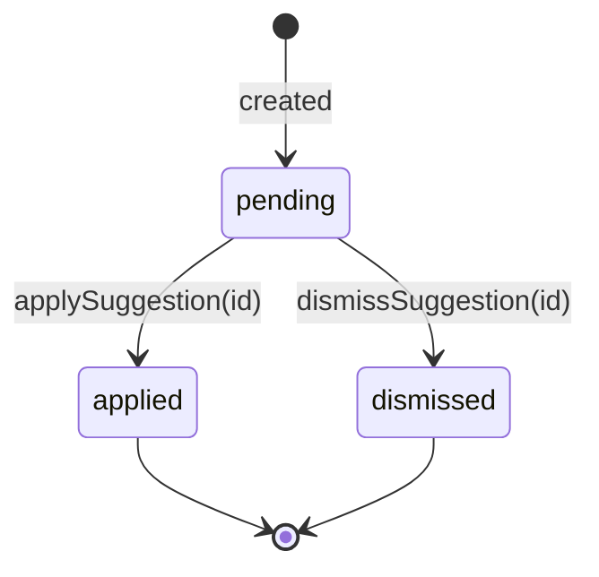
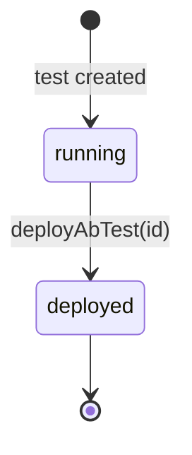

## AGENT QUICK REF
MOD: Campaign Optimization — AI suggestions, A/B tests, fatigue alerts, frequency overrides
ENT: OptimizationSuggestion, AbTest, FatigueAlert, OptimizationHistory, FrequencyOverride
RULE: Suggestions use optimistic delete (filter from state, sync status to Supabase); A/B `deployAbTest` sets testStatus=deployed; FrequencyOverride overrides global cap per segment
DEPS: ← AppContext (5 optimization slices), → Campaigns (campaignId refs), → Segments (segment name refs)

## STATE DIAGRAMS

### OptimizationSuggestion

### AbTest

## ENTITY: OptimizationSuggestion
| Field | Type | Constraint | Meaning |
|---|---|---|---|
| id | string | `sug_N` | PK |
| impact | enum | `high\|medium\|low` | Priority tier |
| campaignId | string | FK → Campaign | Affected campaign |
| campaign | string | display name | — |
| issue | string | — | Root cause description |
| fix | string | — | Recommended action |
| lift | string | — | Expected improvement |
| confidence | string | `%` | Model confidence |
| data | string | — | Evidence summary |
| actionKey | string | — | Action identifier for apply handler |
| status | enum | `pending\|applied\|dismissed` | Lifecycle |

## ENTITY: AbTest
| Field | Type | Meaning |
|---|---|---|
| id | string | `abt_N` |
| campaignId | string | FK → Campaign |
| channel | string | e.g. `Push Notification\|Banner Image\|Send Time` |
| status | string | Display status e.g. `Day 4 of 7` |
| daysLeft | number | Remaining test days |
| significance | string | Statistical significance `%` |
| winner | string | `Variant A\|Variant B` |
| autoDeploy | boolean | Auto-apply winner when significant |
| variantA / variantB | object | `{name, ctr, cvr, widthPct, isLeading}` |
| testStatus | enum | `running\|deployed` | Lifecycle |
| warning | string\|undefined | Low-confidence advisory |

## ENTITY: FatigueAlert
| Field | Type | Meaning |
|---|---|---|
| id | string | `fat_N` |
| name | string | Content name |
| campaignId | string\|null | FK → Campaign (null = default content) |
| daysLive | string | e.g. `22d` |
| ctrWeek1 | string | Baseline CTR |
| ctrNow | string | Current CTR |
| drop | string | `%` CTR decline |
| status | enum | `good\|warn\|bad` | Fatigue severity |

## FATIGUE STATUS THRESHOLDS
| Status | Condition |
|---|---|
| good | drop < 15% |
| warn | 15% ≤ drop < 40% |
| bad | drop ≥ 40% |

## ENTITY: FrequencyOverride
| Field | Meaning |
|---|---|
| segment | Segment name (display, not FK) |
| maxPerDay | Max sends per day |
| maxPerWeek | Max sends per week |
| cooldown | Minimum gap between sends |
| context | Business rationale |

## ENTITY: OptimizationHistory (audit log)
| Field | Meaning |
|---|---|
| time | Timestamp string |
| desc | Action description |
| user | `AI Auto-apply\|System\|{name}` |

## BUSINESS RULES
- `applySuggestion(id)` → optimistic remove from state + Supabase `status=applied`
- `dismissSuggestion(id)` → optimistic remove from state + Supabase `status=dismissed`
- `deployAbTest(id)` → state patch `testStatus=deployed` + Supabase `test_status=deployed`
- `autoDeploy=true` A/B tests are auto-applied when significance threshold reached (UI only in MVP)
- FrequencyOverride applies per named segment; overrides AppContext global defaults
- `FatigueAlert.campaignId=null` → alert applies to default/global content (no campaign link)

## DEV TASK MAP
| Task | Files (in order) |
|---|---|
| Add suggestion action type | `mockData.js` (OPTIMIZATION_SUGGESTIONS.actionKey) → `CampaignOptimizationPage.jsx` |
| Add A/B test variant | `mockData.js` (AB_TESTS) → update variant structure |
| Add frequency rule | `mockData.js` (FREQUENCY_OVERRIDES) |
| Implement auto-deploy logic | `AppContext.jsx` (deployAbTest) → `CampaignOptimizationPage.jsx` |
| Add history entry | `mockData.js` (OPTIMIZATION_HISTORY) or `AppContext.jsx` addLogEntry pattern |

## FILES
| File | Role |
|---|---|
| `pages/CampaignOptimizationPage.jsx` | Full optimization page (26KB) |
| `context/AppContext.jsx` | dismissSuggestion, applySuggestion, deployAbTest; fatigueAlerts, optimizationHistory, frequencyOverrides (read-only) |
| `constants/mockData.js` | OPTIMIZATION_SUGGESTIONS[], AB_TESTS[], FATIGUE_ALERTS[], OPTIMIZATION_HISTORY[], FREQUENCY_OVERRIDES[] |
