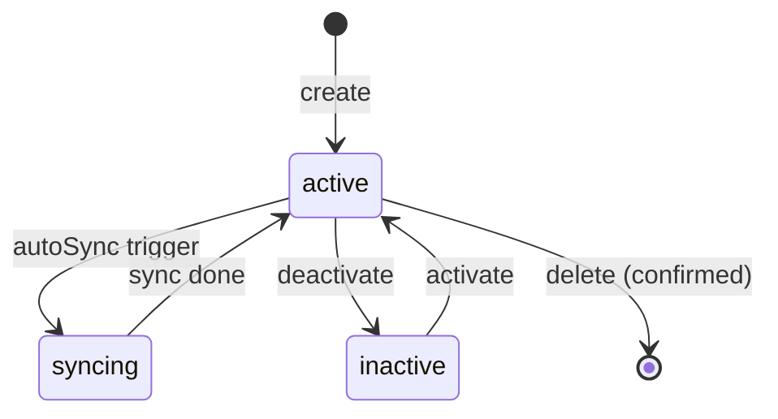

## AGENT QUICK REF
MOD: Segment — define audience filters for campaigns
ENT: Segment, Group, Condition
RULES: Min 1 group; removing last condition removes group; groups joined by globalLogic (AND|OR); within-group conditions joined by AND
DEPS: → AppContext(segments), → mockData(DATASETS/SCHEMA), ← Campaigns(segmentId ref)

## STATE DIAGRAM

## ENTITY: Segment
| Field | Type | Constraint | Meaning |
|---|---|---|---|
| id | string | unique, `seg_N` | PK |
| name | string | required | Display label |
| datasets | string[] | subset of DATASETS | Source datasets used |
| conditions | number | ≥1 | Count of condition rows |
| memberCount | number | ≥0 | Audience size |
| autoSync | boolean | — | Scheduled sync enabled |
| syncFrequency | string | if autoSync=true | e.g. `every 1 day` |
| status | enum | `active\|inactive\|syncing` | Lifecycle state |
| updated | string | relative timestamp | Last modified display |
| lastSync | string | relative timestamp | Last sync display |
| globalLogic | enum | `AND\|OR` | Cross-group join logic |
| groups | Group[] | ≥1 | Condition groups |

## ENTITY: Group
| Field | Type | Constraint | Meaning |
|---|---|---|---|
| id | string | unique | `group_${Date.now()}` |
| dataset | enum | one of DATASETS | Selects SCHEMA namespace |
| conditions | Condition[] | ≥1; empty → group auto-removed | Rows of filter logic |

## ENTITY: Condition
| Field | Type | Constraint | Meaning |
|---|---|---|---|
| id | string | unique | `cond_${Date.now()}` |
| field | string | key in SCHEMA[dataset] | Attribute to filter |
| operator | string | per SCHEMA[dataset][field].operators | Comparison |
| value | string\|string[] | per field type | Filter value |

## DATASETS & SCHEMA (abbreviated)
| Dataset | Key Fields |
|---|---|
| Customer Profile | Age, Gender, City, Province, KYC Status, Birthday in X days, Customer Type |
| Loyalty Status | Current Points, Tier[Bronze/Silver/Gold/Platinum], Points Expiring in X days, Never Redeemed |
| Transaction Behavior | Total Amount (30d), Transaction Count (30d), Last Transaction, Transaction Type, No Transaction in X days |
| App Engagement | Last Login, Login Count (30d), Feature Used, Product Viewed, No Login in X days |

## BUSINESS RULES
- `globalLogic` controls cross-group logic: `AND` = all groups must match; `OR` = any group matches
- Within a group, all conditions joined by implicit `AND`
- Cannot remove last group; min 1 group always present
- Changing `dataset` on a group resets all its conditions to `[{field:'', operator:'', value:''}]`
- `autoSync=false` → `syncFrequency` is empty string; status never enters `syncing`
- `status=syncing` is transient; UI-only during active sync

## STATUS TRANSITIONS
| From | To | Trigger |
|---|---|---|
| any | syncing | Sync Now action |
| syncing | active | sync complete |
| active | inactive | Deactivate action |
| inactive | active | Activate action |
| active/inactive | deleted | Delete + modal confirm |

## DEV TASK MAP
| Task | Files to touch (in order) |
|---|---|
| Add field to Segment entity | `mockData.js` → `AppContext.jsx` (transformToSupabase) → `SegmentTable.jsx` |
| Add new Dataset/Field to filter | `ConditionBuilder.jsx` (SCHEMA) → `ConditionRow.jsx` |
| Add segment list column | `SegmentTable.jsx` |
| Add segment action menu item | `SegmentTable.jsx` (actions array) |
| Change sync logic | `AppContext.jsx` (updateSegment) |

## FILES
| File | Role |
|---|---|
| `pages/SegmentListPage.jsx` | List, filter, bulk actions |
| `pages/CreateSegmentPage.jsx` | Create/edit form host |
| `components/segments/SegmentTable.jsx` | Table + row actions |
| `components/segments/ConditionBuilder.jsx` | Group/condition UI + SCHEMA |
| `components/segments/ConditionRow.jsx` | Single condition row |
| `components/segments/SegmentPreviewCard.jsx` | Audience size preview |
| `context/AppContext.jsx` | addSegment, updateSegment, deleteSegment |
| `constants/mockData.js` | SEGMENTS[], DATASETS[], (SCHEMA in ConditionBuilder) |
