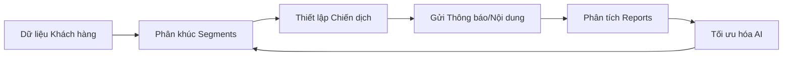

# HƯỚNG DẪN SỬ DỤNG HỆ THỐNG DIGITAL MARKETING MVP

Chào mừng bạn đến với hệ thống quản trị Marketing tích hợp. Tài liệu này cung cấp hướng dẫn chi tiết cách sử dụng các tính năng chính của hệ thống để tối ưu hóa chiến dịch và quản lý khách hàng hiệu quả.

### Quy trình làm việc cơ bản

---

## 1. Bảng điều khiển Tổng quan (Dashboard)
Trang Tổng quan là nơi bạn có cái nhìn toàn diện về hoạt động Marketing hiện tại.

*   **Chiến dịch đang chạy (Active Campaigns):** Theo dõi tiến độ của các chiến dịch đang thực hiện. Thanh tiến trình hiển thị % hoàn thành.
*   **Tối ưu hóa (Optimization):** Hiển thị số lượng đề xuất tối ưu hóa đang chờ xử lý và ước tính doanh thu có thể tăng thêm.
*   **Thử nghiệm A/B (A/B Tests):** Theo dõi các thử nghiệm nội dung đang chạy và kết quả dự đoán (độ tin cậy thống kê).
*   **Lịch trình sắp tới (Upcoming Schedules):** Danh sách các chiến dịch dự kiến chạy trong những ngày tới cùng thời gian và số lượng đối tượng mục tiêu.
*   **Chỉ số hiệu suất (Performance Snapshot):** Xem nhanh các chỉ số quan trọng trong 7 ngày qua như Impressions (Lượt hiển thị), Clicks (Lượt tương tác), Conversions (Chuyển đổi).
*   **Sức khỏe Phân khúc (Segment Health):** Cảnh báo về các tệp khách hàng chưa được đồng bộ dữ liệu hoặc có vấn đề về kết nối.

---

## 2. Quản lý Phân khúc khách hàng (Segments)
Tính năng này giúp bạn chia nhỏ tệp khách hàng dựa trên các điều kiện cụ thể để cá nhân hóa thông điệp.

### 2.1. Tạo Phân khúc mới
1.  Truy cập **Segments** > Nhấn **Create Segment**.
2.  **Thông tin cơ bản:** Nhập tên phân khúc dễ nhận diện.
3.  **Tự động đồng bộ (Auto-sync):** Bật tính năng này nếu bạn muốn hệ thống tự động cập nhật danh sách khách hàng mỗi ngày dựa trên điều kiện đã thiết lập.
4.  **Thiết lập quy tắc (Audience Rules):**
    *   Chọn tập dữ liệu (Customer Profile, Loyalty Status, Transaction Behavior, v.v.).
    *   Thêm các điều kiện lọc (Ví dụ: Tier = Gold AND Chi tiêu > 5tr).
    *   Sử dụng logic **AND** (Tất cả điều kiện) hoặc **OR** (Một trong các điều kiện).
5.  **Xem trước (Preview):** Nhấn **Run Preview** để biết số lượng khách hàng dự kiến thỏa mãn điều kiện.

### 2.2. Sử dụng Template
Để tiết kiệm thời gian, bạn có thể nhấn **Use Template** để chọn các mẫu phân khúc có sẵn như:
*   *High Value At Risk:* Khách hàng giá trị cao nhưng lâu không phát sinh giao dịch.
*   *Points Expiry Alert:* Khách hàng có điểm thưởng sắp hết hạn.
*   *Churning Users:* Khách hàng có nguy cơ rời bỏ hệ thống.

---

## 3. Quản lý Chiến dịch (Campaigns)
Công cụ thực thi các hoạt động Marketing đến khách hàng.

### 3.1. Danh sách chiến dịch
*   **Trạng thái:** Theo dõi chiến dịch đang **Active** (Sẵn sàng), **Running** (Đang chạy), hoặc **Inactive** (Tạm dừng).
*   **Hành động nhanh:**
    *   **Run Now:** Kích hoạt chạy chiến dịch ngay lập tức.
    *   **Duplicate:** Sao chép một chiến dịch có sẵn.
    *   **Edit/Delete:** Chỉnh sửa cấu hình hoặc xóa chiến dịch.
*   **Hành động hàng loạt:** Chọn nhiều chiến dịch để Kích hoạt, Tạm dừng hoặc Xóa cùng lúc.

### 3.2. Lịch chiến dịch (Campaign Calendar)
Truy cập **Calendar** để xem lịch trình các chiến dịch dưới dạng lịch tháng. Điều này giúp bạn tránh việc gửi quá nhiều thông báo cho khách hàng trong cùng một khoảng thời gian.

---

## 4. Nội dung động & Thông báo đẩy (Push Notifications)
Cấu hình thông điệp gửi tới khách hàng.

*   **Thông báo đẩy (Push Notifications):** Thiết lập tiêu đề, nội dung và các biến cá nhân hóa (như tên khách hàng, số điểm thưởng).
*   **Nội dung động (Dynamic Content):** Tạo các khối nội dung tự động thay đổi dựa trên phân khúc khách hàng.

---

## 5. Tối ưu hóa & Thử nghiệm (Optimization)
Hệ thống sử dụng AI để đưa ra các gợi ý giúp tăng hiệu quả Marketing.

*   **Đề xuất tối ưu:** Xem các gợi ý như điều chỉnh thời gian gửi, thay đổi tiêu đề email hoặc điều chỉnh tệp đối tượng.
*   **Thử nghiệm A/B:** So sánh hiệu quả giữa 2 phiên bản nội dung (Phiên bản A và B).

---

## 6. Luồng dữ liệu & Làm giàu dữ liệu (Data Pipeline)
Quản lý kết nối dữ liệu từ các nguồn khác nhau.

*   **Nguồn dữ liệu:** Kiểm tra trạng thái kết nối với CRM, Website, App.
*   **Làm giàu dữ liệu (Enrichment):** Tích hợp thêm thông tin từ bên thứ ba để hiểu sâu hơn về khách hàng.

---

## 7. Báo cáo (Reports)
Phân tích chuyên sâu kết quả sau chiến dịch.

*   Xem biểu đồ tăng trưởng theo thời gian.
*   So sánh hiệu quả giữa các kênh (Push vs SMS vs Email).
*   **Xuất dữ liệu:** Tải báo cáo về định dạng **CSV** hoặc **PDF**.

---

## 8. Nhật ký hoạt động & Thông báo hệ thống
*   **Activity Log:** Theo dõi mọi thay đổi trong hệ thống.
*   **Notification Center:** Nhận thông báo về các sự kiện quan trọng.

---

> [!TIP]
> **Mẹo hữu ích:** Hãy luôn sử dụng tính năng **Preview** trong phần Segments trước khi Lưu để đảm bảo tệp khách hàng mục tiêu của bạn không quá lớn hoặc quá nhỏ.
